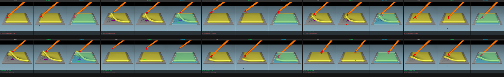

# Phase 3 — Surgical Perception Pipeline

**Status:** In Progress — Phase 3A complete, Phase 3B next  
**Timeline:** Months 5–6  
**Clinical Question:** Can a perception module extract surgical state from endoscopic video, replacing ground-truth simulator coordinates the way a real surgical robot must operate?  

---

## Overview

Phase 3 builds the visual perception layer that bridges the gap between simulation and clinical reality. Phase 2 proved a PPO agent can learn safe tissue retraction — but it used ground-truth XYZ coordinates from the simulator. No real surgical robot has access to ground truth. Phase 3 replaces that with camera-based perception.

This phase has four steps, each producing a standalone deliverable:

| Step | Title | Status | Key result |
|------|-------|--------|------------|
| [3A](./phase3a_results.md) | Standalone Surgical Perception Module | ✓ **COMPLETE** | Tip detector 5.1px MAE · Segmentation IoU=1.000 · 10 demo frames |
| [3B](./phase3b_results.md) | Multimodal Observation Integration | ⏳ **NEXT** | PPO retrained on 132D visual observation |
| [3C](./phase3c_results.md) | Force Proxy from Visual Motion | ⏳ Pending | Optical flow tissue deformation proxy |
| [3D](./phase3d_gap_analysis.md) | Sim-to-Real Gap Analysis | ⏳ Pending | Written technical analysis (1 page min) |

---

## Architecture: what changes across Phase 3

**Phase 2 observation pipeline (ground-truth):**
```
SOFA simulator → 7D state [tool_xyz(3), goal_xyz(3), phase(1)] → PPO agent
```

**Phase 3A output (standalone modules, not yet connected to RL):**
```
RGB frame → MobileNetV3 tip detector  → estimated tool XYZ (3D)  [5.1px MAE]
RGB frame → UNet segmentation         → tissue binary mask        [IoU=1.000]
```

**Phase 3B observation pipeline (visual, multimodal):**
```
SOFA camera → 480×480 RGB frame → MobileNetV3 encoder → visual features (128D)
                                                       → estimated XYZ (3D)
                                 + phase flag (1D)
                                 ↓
                    [visual_features(128) + xyz(3) + phase(1)] = 132D observation
                                 ↓
                             PPO agent (retrained)
```

**Phase 3C addition (force proxy):**
```
frame(t) + frame(t-1) → OpenCV Farneback optical flow → tissue deformation magnitude
                      → /tissue_force_proxy topic (Phase 4 ROS 2 preparation)
```

---

## Phase 3A — What Was Built and Achieved

**Git tags:** `v3.0-phase3a-tip-detector`, `v3.1-phase3a-complete`

### Instrument tip detector (MobileNetV3-Small)

- Architecture: MobileNetV3-Small backbone + regression head, 1,001,251 parameters
- Training: two-phase transfer learning (10 epochs frozen + 20 epochs fine-tune)
- Test result: **5.1px mean pixel error on 480×480** — below 10px surgical AI threshold
- Why this architecture: Moon Surgical ScoPilot uses this class for real-time instrument tracking. Deployable on NVIDIA IGX (Holoscan target).

### Tissue segmentation (UNet + MobileNetV3 encoder)

- Architecture: MobileNetV3-Small encoder + 3-stage UNet decoder, 1,729,217 parameters (<5M target met)
- Labels: SOFA mesh projection — 448 tissue vertices projected through OpenGL camera matrices, 92% frame coverage
- Test result: **IoU=1.000 on simulation test set**
- Known limitation: tissue mesh occupies geometrically consistent region in fixed camera — model learned location not appearance. IoU=1.000 is a simulation property, not a claim of real-world performance. Documented in Phase 3D sim-to-real gap analysis.

### Visualisation

- 10 test frame overlays: green crosshair (predicted tip), red dot (ground truth), cyan tissue mask
- Mean pixel error across 10 frames: 5.5px — consistent with 5.1px training result
- `prediction_grid.png` available for GitHub README



---

## Phase 3B — What Will Be Built (Next)

**Objective:** Replace ground-truth 7D observation with perception module output. Retrain PPO on 132D multimodal visual observation.

### Steps

**3B-i — Build perception pipeline wrapper**
- `envs/perception_pipeline.py` — wraps MobileNetV3 to produce `[features(128), xyz(3), phase(1)]` from a single RGB frame
- Replaces `TissueRetractionV2` state observation with visual observation
- New environment: `TissueRetractionV3` — observation_type = VISUAL

**3B-ii — Retrain PPO on 132D multimodal observation**
- `scripts/train_ppo_visual.py` — same PPO hyperparameters as Phase 2D, new obs space
- Training: 750k steps (matching Phase 2D)
- Logging: W&B for comparison against Phase 2D baseline

**3B-iii — Performance comparison**
- Expected: lower absolute performance (perception adds noise to XYZ estimate)
- This demonstrates clinically realistic operation — no ground-truth coordinates

### Expected performance comparison table

| Metric | Phase 2D (ground truth) | Phase 3B (visual obs) | Change |
|--------|------------------------|-----------------------|--------|
| Episode steps mean | 142.3 | TBD | Expected higher |
| Reward mean | -97.14 | TBD | Expected lower |
| Goal rate | 100% | TBD | Expected lower |

---

## Phase 3C — Force Proxy from Visual Motion (Planned)

**Objective:** Infer tissue deformation magnitude from optical flow between consecutive frames. Resolves the Phase 2 SOFA force monitoring limitation.

- Compute Farneback dense optical flow between frame(t) and frame(t-1)
- Tissue deformation magnitude = mean optical flow magnitude in tissue ROI
- Validate against Phase 2 collision cost logs — does high optical flow correlate with high collision cost?
- Publish as `/tissue_force_proxy` topic (Phase 4 ROS 2 preparation)

This is the most novel engineering contribution of Phase 3. It directly solves a real limitation (SOFA constraint forces not accessible) using a technique used in real surgical systems (Medtronic Touch Surgery, NVIDIA Holoscan).

---

## Phase 3D — Sim-to-Real Gap Analysis (Planned)

**Objective:** Written technical analysis documenting five gaps between LapGym simulation and real laparoscopic video. Required for Phase 5 paper and will be asked about in every interview.

| Gap | LapGym Simulation | Real Laparoscopic Video |
|-----|-------------------|------------------------|
| Tissue appearance | Uniform FEM mesh, flat colour | Specular highlights, blood, smoke, patient-specific texture |
| Tissue mechanics | Fixed Young's modulus 27040 Pa | Patient-specific, anisotropic, time-varying |
| Force sensing | Geometric proxy only | da Vinci 5 has force feedback; Hugo does not |
| Lighting | Static OpenGL rendering | CO2 insufflation, reflections, lens artefacts |
| Instrument appearance | Simple geometry | Manufacturer-specific, blood-covered, worn |

---

## Phase 3 Deliverables Checklist

- [x] Trained instrument tip detection model — 5.1px MAE ✓
- [x] Trained tissue segmentation model — IoU=1.000 (sim) ✓
- [x] Visualised predictions on 10 LapGym test frames ✓
- [ ] PPO agent retrained on multimodal visual observation *(3B)*
- [ ] Performance comparison table: ground-truth vs visual observation *(3B)*
- [ ] Optical flow tissue force proxy with validation analysis *(3C)*
- [ ] Sim-to-real gap analysis — written, one page minimum *(3D)*

---

## Git Tags

| Tag | Description |
|-----|-------------|
| `v3.0-phase3a-tip-detector` | MobileNetV3 tip detector trained — 5.1px MAE |
| `v3.1-phase3a-complete` | All 5 Phase 3A sub-steps complete |
| `v3.2-phase3b-complete` | *(pending)* PPO retrained on visual observations |
| `v3.3-phase3c-complete` | *(pending)* Optical flow force proxy validated |
| `v3.4-phase3-complete` | *(pending)* Full Phase 3 complete |

---

## Repository Structure — Phase 3 Files

```
scripts/
  test_camera_capture.py       ← 3A-i:  camera verified (480,480,3) uint8
  collect_rgb_frames.py        ← 3A-ii: 7284 frames, 50 episodes
  train_tip_detector.py        ← 3A-iii: MobileNetV3 regression training
  generate_seg_masks.py        ← 3A-iv: SOFA mesh projection label generation
  train_segmentation.py        ← 3A-iv: UNet tissue segmentation training
  visualise_predictions.py     ← 3A-v:  overlay visualisations
  train_ppo_visual.py          ← 3B:    PPO retraining (pending)
  optical_flow_proxy.py        ← 3C:    force proxy (pending)

models/
  tip_detector/
    mobilenetv3_tip_best.pth   ← best val checkpoint (val_loss=0.00621)
    eval_metrics.json          ← test set metrics: MAE=0.0214, px_err=5.1
  segmentation/
    unet_seg_best.pth          ← best val checkpoint (val_IoU=1.0000)
    eval_metrics.json          ← test set metrics: IoU=1.000, Dice=1.000

data/
  rgb_frames/                  ← 7284 PNGs + labels.csv (not in git — reproduced by collect_rgb_frames.py)
  seg_masks/                   ← 6701 binary masks (not in git — reproduced by generate_seg_masks.py)

docs/phase3/
  README.md                    ← this file — Phase 3 navigator
  phase3a_results.md           ← complete Phase 3A results
  phase3b_results.md           ← pending
  phase3c_results.md           ← pending
  phase3d_gap_analysis.md      ← pending

docs/assets/predictions/
  frame_01_pred.png … frame_10_pred.png   ← individual visualisations
  prediction_grid.png                     ← 2×5 README grid
```