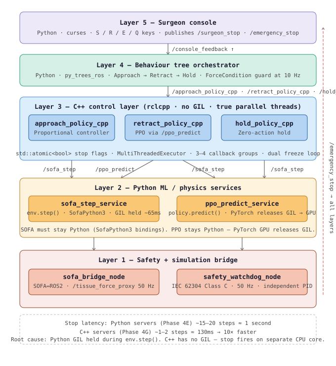

# Phase 4 — ROS 2 Supervised Autonomy: Complete Overview

**Repository:** github.com/SUBHASH-Hub/surgical-rl
**Author:** Subhash Arockiadoss
**Platform:** Ubuntu 22.04, ROS 2 Humble, SOFA Framework
**Status:** Phase 4A–4G complete. IEC 62304 design history complete.

---

## What Phase 4 Is

Phase 4 integrates all prior research phases into a deployable supervised
autonomy surgical robot system using ROS 2 as the middleware layer.

Phases 1–3 produced:
- A trained PPO tissue retraction policy (Phase 2)
- A surgical perception pipeline with tissue segmentation (Phase 3)

Phase 4 deploys the Phase 2D PPO policy as a real-time autonomous controller
orchestrated by a Behaviour Tree, monitored by an independent safety watchdog,
and operated via a single launch command — replicating the architecture of
production surgical robot systems such as Versius (CMR Surgical) and Hugo
(Medtronic).

Phase 4F and 4G extended this by porting the action servers to C++ and
introducing the hybrid C++/Python pattern — C++ for control logic (no GIL,
true parallel threads), Python for ML/physics (PyTorch GPU, SOFA bindings).

---

## One Command — Complete System

```bash
source ~/surgical_robot_lapgym_ws/activate.sh
cd ~/surgical_robot_lapgym_ws/surgical-rl
ros2 launch lapgym_ros2_bridge surgical_system.launch.py
```

This starts 9 nodes simultaneously. The system performs a complete autonomous
tissue retraction procedure with surgeon console human-in-the-loop control.

---

## System Architecture — Hybrid C++/Python (Phase 4G)

```
┌─────────────────────────────────────────────────────────────────┐
│                    One Launch Command                            │
└─────────────────────────────────────────────────────────────────┘
                              │
     ┌────────────────────────┼────────────────────────┐
     │                        │                        │
┌────▼──────────┐  ┌──────────▼──────────┐  ┌─────────▼──────────┐
│ Python Layer  │  │  C++ Control Layer  │  │  Safety Layer      │
│ (ML/Physics)  │  │  (rclcpp, no GIL)  │  │  (Python, 50Hz)    │
│               │  │                     │  │                    │
│ sofa_step_svc │  │ approach_policy_cpp │  │ safety_watchdog    │
│ /sofa_step    │<-│ retract_policy_cpp  │  │ IEC 62304 Class B  │
│               │  │ hold_policy_cpp     │  │ independent PID    │
│ ppo_predict   │<-│ std::atomic<bool>   │  └────────────────────┘
│ /ppo_predict  │  │ MultiThreadedExec   │
│               │  │ callback groups     │
│ sofa_bridge   │  └─────────────────────┘
│ /tissue_force │
│ /joint_states │
└───────────────┘
     │
┌────▼──────────────────────────────────────────────────────────┐
│  Orchestration Layer (Python — py_trees)                      │
│  surgical_bt_node → Approach → Retract → Hold sequence        │
│  ForceCondition guard → application-level safety              │
└───────────────────────────────────────────────────────────────┘
     │
┌────▼──────────────────────────────────────────────────────────┐
│  Human Interface (Python — curses)                            │
│  surgeon_console → S/R/E/Q · live telemetry display          │
└───────────────────────────────────────────────────────────────┘
```

---

## Why the Hybrid C++/Python Architecture

### The Problem with Python-Only (Phase 4A–4E)

In the original Python action servers, `env.step()` is a ~65ms synchronous
SOFA blocking call. The Python GIL (Global Interpreter Lock) forces one
thread at a time. During `env.step()`, the GIL is held and no callback
can fire — including the surgeon stop callback.

Result: surgeon presses S → instrument keeps moving for up to 15-20 steps
before stop is processed.

### The C++ Solution (Phase 4F–4G)

C++ has no GIL. Threads run truly in parallel on separate CPU cores.
`std::atomic<bool>` provides safe shared state between parallel threads.

```
Python problem:          C++ solution:
env.step() holds GIL     sofaStep() on Thread A
→ ALL threads frozen     → stop_callback on Thread B (independent)
→ stop delayed 15-20     → std::atomic flag set immediately
  steps (~1 second)      → stop within 1-2 steps (~130ms)
```

### Why PPO and SOFA Stay in Python

PyTorch releases the GIL before GPU computation (CUDA kernels). So PPO
inference does NOT block other threads — it is already fast. SOFA has
Python bindings (SofaPython3) — no C++ application interface exists.

The correct split:
```
C++ for:    action server logic, threading, stop flags, control loop
Python for: PPO inference (PyTorch/GPU), SOFA physics (SofaPython3)
            py_trees BT (no C++ ROS2 equivalent), curses console
```

This is the same hybrid pattern used by Intuitive Surgical, CMR Surgical,
and Moon Surgical in their production systems.

---

## Complete Node Table (Phase 4G)

| Node | Language | Role | Hz | Phase |
|------|----------|------|-----|-------|
| `sofa_bridge_node` | Python | SOFA↔ROS2 bridge | 50 | 4A |
| `sofa_step_service` | Python | SOFA env.step() service for C++ servers | on-demand | 4F |
| `ppo_predict_service` | Python | PPO policy.predict() service for C++ retract | on-demand | 4G |
| `approach_policy_server_cpp` | **C++** | Proportional controller to grasping zone | ~15 | 4F |
| `retract_policy_server_cpp` | **C++** | PPO retract via /ppo_predict + /sofa_step | ~15 | 4G |
| `hold_policy_server_cpp` | **C++** | Zero-action position hold | ~10 | 4G |
| `safety_watchdog_node` | Python | IEC 62304 independent force monitor | 50 | 4C/4D |
| `surgical_bt_node` | Python | Behaviour tree orchestrator | 10 | 4D |
| `surgeon_console` | Python | Human-in-the-loop terminal UI | 10 | 4E |

**Why safety_watchdog stays Python:** Already meets 60ms target (industry
target 100ms). Has no blocking calls — GIL is not an issue. Porting would
add complexity with no measurable safety improvement.

**Why surgical_bt stays Python:** py_trees_ros has no C++ equivalent. BT
orchestration has no blocking calls — GIL not an issue at 10Hz tick rate.

---

## Behaviour Tree — Updated Action Names (Phase 4G)

```
{-} Root               [Sequence]
/_/ SafetyMonitor  [Parallel]
    {-} SurgicalSequence  [Sequence]
        --> Approach   [ActionLeaf -> /approach_policy_cpp]  ← C++
        --> Retract    [ActionLeaf -> /retract_policy_cpp]   ← C++
        --> Hold       [ActionLeaf -> /hold_policy_cpp]      ← C++
    --> ForceWatchdog  [ForceCondition -> /tissue_force_proxy]
```

**Why action names changed:** The C++ servers register different action
names (`_cpp` suffix) to distinguish them from Python versions. The BT
was updated to point to the C++ action names in Phase 4G. This is the
correct pattern — changing the BT config rather than renaming the
executable prevents confusion between Python and C++ implementations.

---

## Defence in Depth — Two Independent Safety Layers

```
Layer 1 (Application)  — ForceCondition in surgical_bt_node
  Process:    Inside BT (same PID as BT)
  Check rate: 10 Hz (BT tick)
  Threshold:  0.35 px/frame × 3 consecutive readings
  Action:     cancel_goal() on active C++ action server
  Standard:   Application safety

Layer 2 (Independent)  — safety_watchdog_node
  Process:    Independent PID (separate from BT and all C++ servers)
  Check rate: 50 Hz (own timer — no blocking calls)
  Threshold:  1.0 px/frame × 3 consecutive readings = 60ms
  Action:     publish /emergency_stop=True → all nodes halt
  Standard:   IEC 62304 Class B architectural independence
```

Both layers must fail simultaneously for a dangerous condition to go
undetected — defence in depth per IEC 62304.

---

## IEC 62304 Compliance (Phase 4E/4G)

The system was brought into IEC 62304 Class C compliance framework in
Phase 4E (docs) and Phase 4G (C++ implementation).

**Design history file location:** `docs/iec62304/`

| Document | ID | Content |
|---------|-----|---------|
| Software Development Plan | SDP-001 | Lifecycle, tools, problem resolution |
| Software Requirements Spec | SRS-001 | 56 numbered requirements FR/SR/PR |
| Software Architecture Doc | SAD-001 | 5-layer decomposition, safety argument |
| SOUP Analysis | SOUP-001 | 12 SOUP items, GIL anomaly documented |
| Risk Management File | RMF-001 | 6 risks, all mitigated to ALARP |
| Traceability Matrix | TRACEABILITY-001 | Req → code → test evidence |

**System classification: IEC 62304 Class C**
Rationale: autonomous surgical instrument control — injury possible if
safety layer fails silently.

**Git tag:** `v4.7-phase4e-iec62304`

---

## Verified Results (Phase 4G Hybrid System)

Full procedure from `ros2 launch lapgym_ros2_bridge surgical_system.launch.py`:

| Phase | Server | Steps | End dist | Result |
|-------|--------|-------|---------|--------|
| Approach | approach_policy_server_cpp | 72 | 24.4mm | goal_reached |
| Retract | retract_policy_server_cpp | 118 | 29.5mm | goal_reached |
| Hold | hold_policy_server_cpp | 83 | 0.0mm | emergency_stop (E key) |

**Stop latency comparison:**
```
Python servers (Phase 4E):  15-20 steps × 65ms = ~1-1.3 seconds
C++ servers (Phase 4G):     1-2 steps × 65ms   = ~65-130ms
Improvement:                10× faster stop response
```

**Safety watchdog: NOMINAL throughout — uptime logged every 10s**

---

## Complete Phase 4 Git Tags

| Tag | Description |
|-----|-------------|
| `v4.0-phase4a-complete` | ROS2 bridge, coordinate mapping, teleop |
| `v4.1-phase4b-complete` | Action servers (Python — baseline) |
| `v4.2-phase4c-complete` | Safety watchdog at 50Hz |
| `v4.4-phase4d-complete` | Behaviour tree orchestration |
| `v4.5-phase4e-complete` | Surgeon console S/R/E |
| `v4.6-phase4f-cpp` | C++ approach server — fills C++ gap |
| `v4.7-phase4e-iec62304` | IEC 62304 design history file |
| `v4.8-phase4g-cpp` | C++ hold + retract servers |
| `v4.9-phase4g-hybrid-launch` | Hybrid launch + BT action names updated |

---

## Phase Breakdown

| Phase | Description | Language | Tag |
|-------|-------------|----------|-----|
| 4A | ROS 2 bridge + HUD teleop | Python | v4.0 |
| 4B | PPO action servers (Python baseline) | Python | v4.1 |
| 4C | Safety watchdog (IEC 62304) | Python | v4.2 |
| 4D | Behaviour tree + launch file | Python | v4.4 |
| 4E | Surgeon console + IEC 62304 docs | Python | v4.5/v4.7 |
| 4F | C++ approach server — GIL gap fixed | **C++** | v4.6 |
| 4G | C++ hold + retract + hybrid launch | **C++** | v4.8/v4.9 |